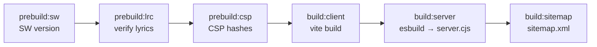

<div align="center">

# 🎧 NL — Noureddin El Mobaraki
### <sub>aka **Nordine GB** · Official Web Platform</sub>

<p>
<a href="https://noureddinelmobaraki-web.github.io/NL/">
  
</a>


</p>

<p>


</p>
<p>


</p>

<br>

<table>
<tr>
<td align="center" width="33%">🎵<br><b>Immersive Player</b><br><sub>Adaptive HLS audio &amp; video</sub></td>
<td align="center" width="33%">📻<br><b>Retro World</b><br><sub>Cassette / radio simulator</sub></td>
<td align="center" width="33%">🚀<br><b>SEO-First Static</b><br><sub>JSON-LD · sitemap · share cards</sub></td>
</tr>
</table>

</div>

> <div dir="rtl"><b>بالعربية:</b> هذا الموقع هو المنصة الرسمية للفنان المغربي <b>نور الدين المباركي (NL / Nordine GB)</b> — مشغّل موسيقى تفاعلي، أرشيف إصدارات، وعالم ريترو، مع دعم كامل للفهرسة (SEO) والعربية/الإنجليزية.</div>

The official single-page web platform of Moroccan rap artist and independent producer **Noureddin El Mobaraki** — known as **NL** / **Nordine GB**. It combines an immersive media player, a retro cassette-radio world, an automated social share-page system, and a strict, SEO-first static deployment.

<div align="center"><b>🌐 Live:</b> <a href="https://noureddinelmobaraki-web.github.io/NL/">noureddinelmobaraki-web.github.io/NL/</a></div>

---

## 🗺️ Table of Contents

<table>
<tr>
<td>

- [✨ Features](#-features)
- [🧱 Tech Stack](#-tech-stack)
- [🏛️ Architecture](#-architecture)
- [⚡ Getting Started](#-getting-started)

</td>
<td>

- [🛠️ Scripts](#-scripts)
- [📦 Build Pipeline](#-build-pipeline)
- [🔒 Security &amp; CSP](#-security--csp)
- [📈 SEO Architecture](#-seo-architecture)

</td>
<td>

- [🧪 Testing &amp; QA](#-testing--qa)
- [🚀 Deployment](#-deployment)
- [🎶 Distribution](#-distribution-channels)
- [📄 License](#-license)

</td>
</tr>
</table>

---

## ✨ Features

| | Feature | Description |
| :---: | :--- | :--- |
| 🎵 | **Immersive media player** | Adaptive HLS (`.m3u8`) streaming via `hls.js`, with a managed audio engine that prioritizes sources (background, song, lens, video, intro) so they never overlap. |
| 📻 | **Retro world** | An interactive cassette/radio simulator with its own ambience track. |
| 🔗 | **Automated share pages** | Pre-rendered static wrappers under `public/share/` with rich Open Graph / Twitter cards for WhatsApp, Facebook and X previews. |
| 🔍 | **SEO-first** | Canonical URL, `Person` JSON-LD, image sitemap, and an absolute `robots.txt` sitemap reference. |
| 🔒 | **Strict CSP** | Inline-script hashes generated at build time; no `unsafe-inline` for scripts. |
| ♻️ | **Service worker** | Versioned at build time for safe cache invalidation. |
| 🌐 | **RTL-first** | `index.html` ships `lang="ar" dir="rtl"` with bilingual metadata. |
| 📱 | **Mobile QA overlay** | A `?qa=1` developer HUD for live viewport / breakpoint / context inspection. |

---

## 🧱 Tech Stack

| | Layer | Technology | Notes |
| :---: | :--- | :--- | :--- |
| ⚛️ | UI runtime | **React 19** | Hooks-based; React Compiler enabled (`babel-plugin-react-compiler`). |
| ⚡ | Bundler | **Vite 6** | esbuild + Rollup pipeline; visualizer for `analyze`. |
| 🔷 | Language | **TypeScript ~5.9** | `tsc --noEmit` enforced in CI lint. |
| 🎨 | Styling | **Tailwind CSS v4** | Native Vite plugin (`@tailwindcss/vite`). |
| 🎬 | Animation | **Framer Motion v12** | Physics-based transitions. |
| 📡 | Streaming | **hls.js 1.6** | Adaptive bitrate audio/video. |
| 🖥️ | Dev/SSR server | **Express 5 (tsx)** | `server.ts`, bundled with esbuild for production. |
| 🧪 | Tests | **Vitest 4** | jsdom + Testing Library. |
| 🌟 | Icons | **lucide-react** | |
| 🖼️ | Images | **sharp** | WebP optimization pipeline. |

> 💡 Always treat `package.json` as the source of truth for exact versions.

---

## 🏛️ Architecture

```
╔═════════════════════════════════════════════════════╗
║              CLIENT APPLICATION (SPA)                  ║
║   React 19 · Vite 6 · Tailwind v4 · Framer Motion      ║
╠════════════════════════════════════════════════════╣
║  ─ Managed audio engine (priority + fade)              ║
║  ─ hls.js adaptive player                              ║
║  ─ SEO / JSON-LD / share-card metadata                 ║
║  ─ LocalStorage caches · Service worker                ║
╚═════════════════════════╦══════════════════════════╝
                          │ HLS (.m3u8) over HTTPS
                          ▼
╔═════════════════════════════════════════════════════╗
║     EXTERNAL AUDIO / VIDEO CDN (GitHub Pages)          ║
║     noureddinelmobaraki-web.github.io/nl-audio-cdn     ║
╚═════════════════════════════════════════════════════╝

  Dev/build only:  Express 5 server (server.ts via tsx → dist/server.cjs)
```

<div align="center"><b>Deployed base path:</b> <code>/NL/</code> on GitHub Pages.</div>

---

## ⚡ Getting Started

<table>
<tr><th>Prerequisite</th><th>Version</th></tr>
<tr><td>🟢 Node.js</td><td><code>&gt;= 20</code> (see <code>engines</code> in <code>package.json</code>)</td></tr>
<tr><td>📦 npm</td><td><code>&gt;= 10</code></td></tr>
</table>

```bash
npm install      # install dependencies
npm run dev      # start the local Express + Vite dev server (server.ts via tsx)
```

> 💡 Then open the printed local URL in your browser.

---

## 🛠️ Scripts

<details open>
<summary><b>🔹 Core</b> — develop, build, run</summary>

| Script | Command | Purpose |
| :--- | :--- | :--- |
| `dev` | `tsx server.ts` | Local development server. |
| `build` | `build:client && build:server && build:sitemap` | Full production build (runs `prebuild` first). |
| `build:client` | `vite build` | Compile the client bundle. |
| `build:server` | `esbuild server.ts → dist/server.cjs` | Bundle the server for production. |
| `build:sitemap` | `node scripts/generate-sitemap.mjs` | Generate `sitemap.xml`. |
| `start` | `node dist/server.cjs` | Run the built production server. |
| `preview` | `vite preview` | Preview the built client bundle. |

</details>

<details>
<summary><b>🔸 Pre-build hooks</b> — auto-run before <code>build</code></summary>

| Script | Command | Purpose |
| :--- | :--- | :--- |
| `prebuild` | `prebuild:sw && prebuild:lrc && prebuild:csp` | Orchestrates the three hooks below. |
| `prebuild:sw` | `node scripts/generate-sw-version.js` | Stamp a service-worker version. |
| `prebuild:lrc` | `node scripts/verify-lrc.mjs` | Validate lyric (`.lrc`) assets. |
| `prebuild:csp` | `node scripts/hash.mjs --write` | Recompute CSP inline-script hashes. |

</details>

<details>
<summary><b>🔸 Quality</b> — lint &amp; tests</summary>

| Script | Command | Purpose |
| :--- | :--- | :--- |
| `lint` | `tsc --noEmit && eslint src --max-warnings=0` | Strict type + lint check. |
| `lint:ts` | `tsc --noEmit` | Type check only. |
| `lint:eslint` | `eslint src --max-warnings=0` | ESLint only. |
| `test` | `vitest run` | Run the unit test suite once. |
| `test:watch` | `vitest` | Watch-mode tests. |
| `test:song` | `vitest run songs lyrics hooks` | Focused song/lyrics/hooks tests. |
| `audit` | `npm audit --omit=dev --audit-level=high` | Production dependency audit. |

</details>

<details>
<summary><b>🔸 Assets &amp; tooling</b></summary>

| Script | Command | Purpose |
| :--- | :--- | :--- |
| `optimize:images` | `node scripts/optimize-images.mjs` | Encode images to WebP via sharp. |
| `generate:posters` | `node scripts/generate-posters.mjs` | Generate poster artwork. |
| `analyze` | `vite build --mode analyze` | Bundle-size visualizer. |
| `hash:csp` | `node scripts/hash.mjs` | Print CSP hashes (no write). |
| `clean` | `rm -rf dist` | Remove build output. |

</details>

---

## 📦 Build Pipeline

Running `npm run build` executes, in order:



1. **`prebuild`** — stamps a fresh service-worker version, verifies lyric files, and recomputes inline-script hashes into the CSP meta tag.
2. **`build:client`** — Vite compiles the SPA into `dist/`.
3. **`build:server`** — esbuild bundles `server.ts` into `dist/server.cjs`.
4. **`build:sitemap`** — generates the canonical XML sitemap.

> ⚠️ If you change any inline `<script>` in `index.html`, you **must** re-run `prebuild:csp` (or a full build) or the CSP will block it in production.

---

## 🔒 Security & CSP

- The site ships a **strict Content Security Policy** in the `<head>` of `index.html`. Script execution relies on **per-hash allowlisting**, regenerated by `scripts/hash.mjs --write` during `prebuild`.
- Allowed external origins are intentionally narrow (self + the audio CDN + EmailJS for the contact form). Adding a new third-party origin requires updating the CSP `connect-src` / `script-src` accordingly.
- See **[SECURITY.md](./SECURITY.md)** for the vulnerability disclosure policy.

---

## 📈 SEO Architecture

| Element | Detail |
| :--- | :--- |
| 🎯 **Canonical** | `https://noureddinelmobaraki-web.github.io/NL/` |
| 🧠 **Structured data** | A `Person` JSON-LD block (name, `alternateName`, locality Casablanca, `sameAs` platform links) for the Google Knowledge Graph. |
| 🗺️ **Sitemap** | Generated by `scripts/generate-sitemap.mjs`; includes the canonical root, static share pages, and `<image:image>` artwork entries. |
| 🤖 **robots.txt** | References the sitemap with an **absolute** URL: `https://noureddinelmobaraki-web.github.io/NL/sitemap.xml`. |
| ✅ **Ownership** | A Google Search Console verification file lives at the site root. |

> 💡 When submitting to Google Search Console, submit the `/NL/sitemap.xml` path (the project is served from the `/NL/` sub-path, not the bare domain root).

---

## 🧪 Testing & QA

- **Unit tests:** `npm run test` (Vitest + jsdom + Testing Library). Use `npm run test:song` for the song/lyrics/hooks subset.
- **Type & lint gate:** `npm run lint` must pass with **zero** warnings.
- **Mobile QA overlay:** append <kbd>?qa=1</kbd> to the dev URL to render a live HUD showing viewport size, active Tailwind breakpoint, DPR, CPU cores, and open overlays/modals.
- **Lighthouse:** run a Mobile audit on the production build; target ≥ 90 performance, 44×44px tap targets, and valid ARIA labels.

---

## 🚀 Deployment

The app is a static client bundle served from **GitHub Pages** under the `/NL/` base path. See **[DEPLOYMENT.md](./DEPLOYMENT.md)** for the full release procedure.

```bash
npm run build     # produces dist/
# publish dist/ to the GitHub Pages target documented in DEPLOYMENT.md
```

---

## 🎶 Distribution Channels

<div align="center">

| Platform | Link |
| :---: | :--- |
| 🟢 **Spotify** | [open.spotify.com/artist/…](https://open.spotify.com/artist/5nwGOyilF1p4uv35v6vb2u) |
| 🍎 **Apple Music** | [music.apple.com/…/nl](https://music.apple.com/us/artist/nl/1535833912) |
| 🎵 **Deezer** | [deezer.com/…/artist](https://www.deezer.com/en/artist/362375722) |
| 📦 **Amazon Music** | [music.amazon.fr/…/nl](https://music.amazon.fr/artists/B0025ODH90/nl) |
| 🎧 **Anghami** | [play.anghami.com/artist](https://play.anghami.com/artist/1430009) |
| ☁️ **SoundCloud** | [on.soundcloud.com/…](https://on.soundcloud.com/Ok8zBgOjCPqjvStEA) |
| ▶️ **YouTube** | [@nourdin_el_mobaraki](https://www.youtube.com/@nourdin_el_mobaraki) |

</div>

---

## 📄 License

<div align="center">

**Proprietary &amp; private** (`"private": true`) · All rights reserved © Noureddin El Mobaraki (NL / Nordine GB)

<sub>The code, music, artwork, and brand assets may not be copied, redistributed, or reused without explicit written permission.</sub>

</div>
